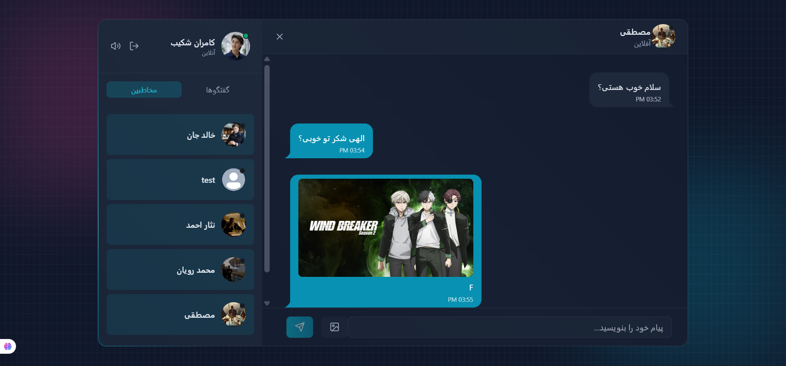

#  Real-Time Chat Application

A modern real-time chat application with user authentication and online/offline status system.



---
Demo: https://chat-application-9ven.onrender.com/

---
##  Features

-  User Authentication (Sign Up & Login)
-  Real-time messaging
-  Online /  Offline user status
-  Private chat between users
-  Message history
-  Fast and responsive UI

---

##  Technologies Used

### Frontend:
- React.js
- TailwindCSS 

### Backend:
- Node.js
- Express.js

### Database:
- MongoDB

### Real-time Communication:
- Socket.io (WebSockets)

---

## 📦 Installation

### 1. Clone the repository

```bash
git clone https://github.com/kamranshakib/Chat-Application.git


